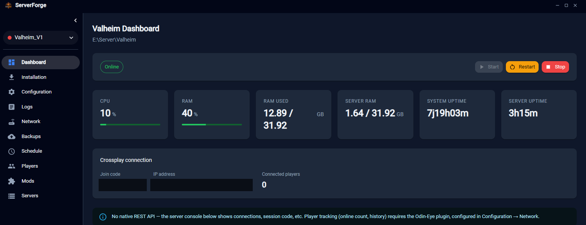
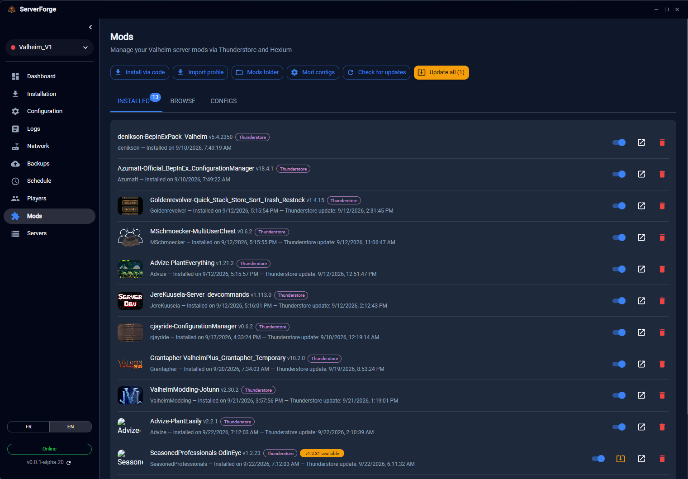
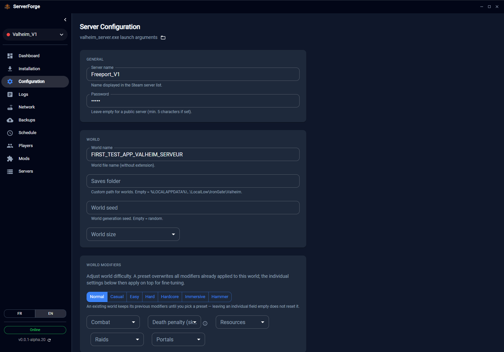
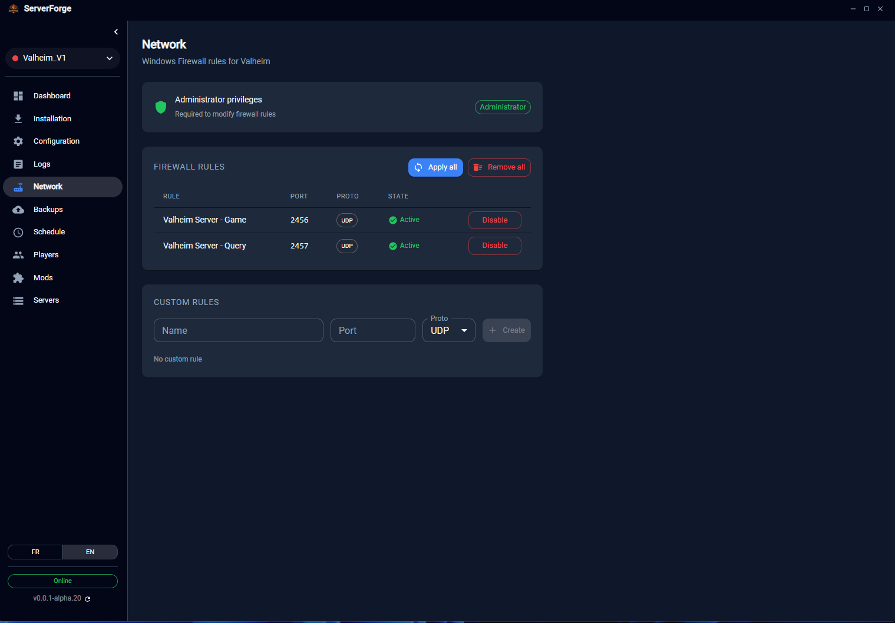
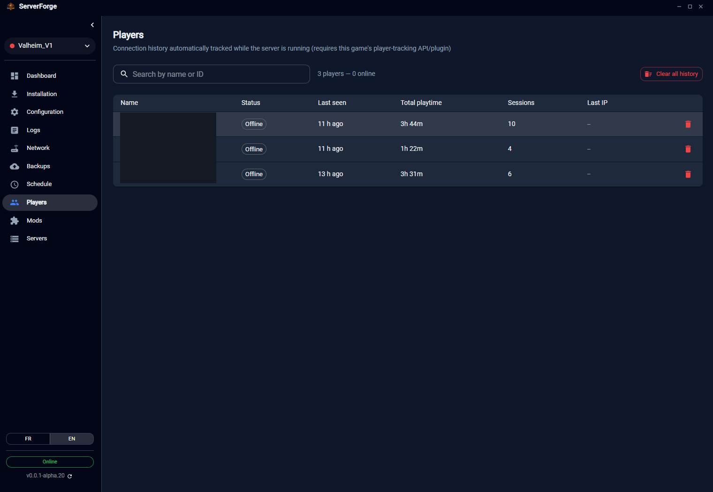

# ServerForge

🇬🇧 English | 🇫🇷 [Français](README.fr.md)

> ⚠️ **The current name and logo are temporary.** The project's final branding has not been decided yet.

Desktop manager for dedicated game servers. Compatible with **Palworld**, **Valheim**, and **Astroneer**.

## Features

- **Automatic installation** of SteamCMD and the game server
- **Start / stop / restart** with graceful shutdown via the REST API
- **Real-time monitoring**: CPU, RAM, uptime, server FPS, online players
- **INI configuration editor** with difficulty presets (Casual / Normal / Hard)
- **Player management**: kick, ban, unban directly from the dashboard
- **Windows firewall management** (automatic + custom rules)
- **Scheduled automatic backups** with rotation
- **Daily scheduled restart** with in-game announcement and save
- **Update checking** via SteamCMD
- **Real-time logs** of the server process

## Screenshots

<table>
  <tr>
    <td> Dashboard</td>
    <td> Mods (Thunderstore & Hexium)</td>
  </tr>
  <tr>
    <td> Server configuration</td>
    <td> Firewall rules</td>
  </tr>
  <tr>
    <td> Player history</td>
    <td></td>
  </tr>
</table>

## Installation

Download the latest version from [Releases](https://github.com/THEREALM00D/server-forge/releases):

- **Installer**: `server-forge-{version}-setup.exe`
- **Portable**: `server-forge-{version}-portable.exe`

> The application requires **administrator rights** to manage Windows firewall rules.

## Quick start

1. Launch **ServerForge**
2. Go to **Install**
3. Click **Install SteamCMD** (automatic download)
4. Choose a destination folder and install the server for your game
5. Go to **Dashboard** and click **Start**

See [docs/installation.md](docs/installation.md) for the full guide.

## Documentation

- [Installation](docs/installation.md)
- [Dashboard](docs/dashboard.md)
- [Server configuration](docs/configuration.md)
- [Network & firewall](docs/network.md)
- [Backups](docs/backups.md)
- [Scheduling](docs/scheduling.md)
- [Logs](docs/logs.md)
- [Valheim player tracking (Odin-Eye)](docs/valheim-players.md)
- [Technical architecture](CLAUDE.md)

## Tech stack

- Electron 31, React 19, MUI 9, TypeScript 6, Vite 5

## License

Proprietary — all rights reserved. See [LICENSE](LICENSE). This code is not open-source: making it publicly visible during the alpha does not grant any right to use, copy, or redistribute it.

## Contributing

The `main` branch is protected: all contributions go through a Pull Request, and only the project maintainer can merge it.
